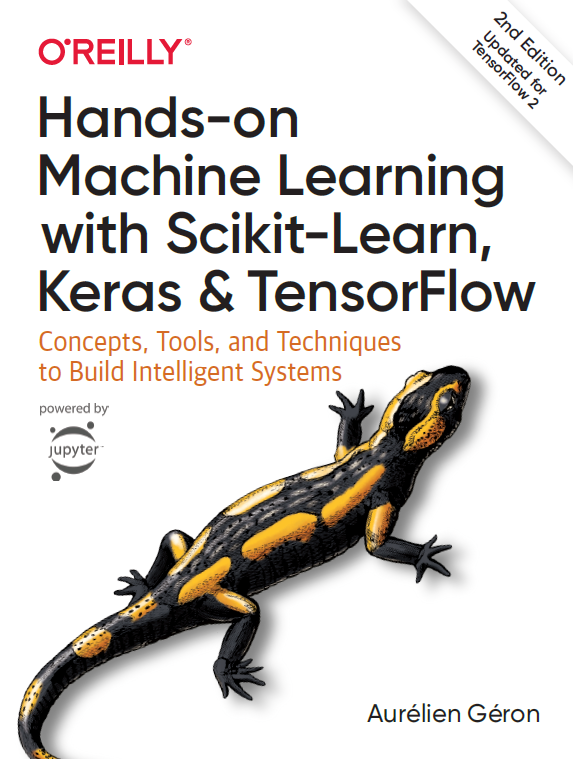

# Hands-On Machine Learning with Scikit-Learn and TensorFlow: Concepts, Tools, and Techniques to Build Intelligent Systems BY Aurelien Geron

This repository is made to act as a reference for me and others after reading and completing the book exerise , the book is named Hands-On Machine Learning with Scikit-Learn and TensorFlow  Concepts, Tools, and Techniques to Build Intelligent Systems BY Aurelien Geron and its probably one of the best books on Machine Learning that i have read as of now.

    
     
    <a href="https://www.oreilly.com/library/view/hands-on-machine-learning/9781491962282/" target="_blank"><strong>Hands-On Machine Learning with Scikit-Learn and TensorFlow</strong></a>

